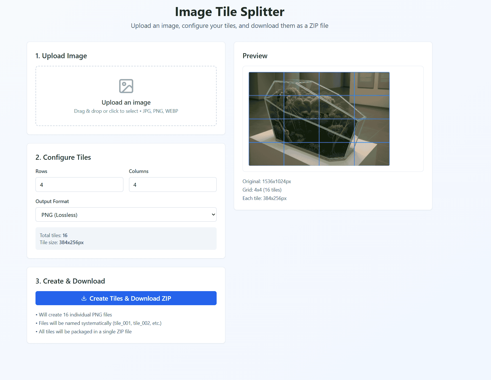

# img2tiles

A modern web application that allows you to split images into tiles and download them as a ZIP file. Perfect for creating image puzzles, preparing assets for game development, or breaking down large images into manageable pieces.

  



## Features

- **Easy Image Upload**: Drag & drop or click to upload JPG, PNG, or WEBP images
- **Flexible Grid Configuration**: Split images into any grid size (1x1 to 20x20)
- **Real-time Preview**: See exactly how your image will be split with an interactive grid overlay
- **Multiple Output Formats**: Export tiles as PNG (lossless) or JPG (with quality control)
- **Batch Download**: All tiles are automatically packaged into a single ZIP file
- **Responsive Design**: Works perfectly on desktop and mobile devices
- **No Server Required**: Everything runs in your browser for maximum privacy

## How to Use

1. **Upload an Image**
   - Click the upload area or drag and drop an image file
   - Supported formats: JPG, PNG, WEBP
   - The image will be displayed with its dimensions

2. **Configure Your Tiles**
   - Set the number of rows and columns for your grid
   - Choose output format (PNG for lossless quality, JPG for smaller file sizes)
   - For JPG format, adjust the quality slider (10-100%)
   - View the total number of tiles and individual tile dimensions

3. **Preview Your Split**
   - The preview shows your image with a grid overlay
   - Each section represents one tile that will be created
   - Grid lines show exactly where the image will be split

4. **Create and Download**
   - Click "Create Tiles & Download ZIP"
   - Wait for processing to complete
   - Your ZIP file will automatically download
   - Files are named systematically: tile_001, tile_002, etc.

## Technical Details

### Built With

- **React 18.3.1** - Modern UI framework
- **TypeScript** - Type-safe development
- **Vite** - Fast build tool and development server
- **Tailwind CSS** - Utility-first CSS framework
- **shadcn/ui** - Beautiful, accessible component library
- **JSZip** - Client-side ZIP file generation
- **Lucide React** - Beautiful icons

### Key Dependencies

- `jszip` - For creating ZIP files containing all tiles
- `@tanstack/react-query` - Data fetching and state management
- `react-router-dom` - Client-side routing
- `lucide-react` - Icon library

## Development

### Prerequisites

- Node.js (v16 or higher)
- npm or yarn package manager

### Installation

1. Clone the repository:
```bash
git clone <YOUR_GIT_URL>
cd <YOUR_PROJECT_NAME>
```

2. Install dependencies:
```bash
npm install
```

3. Start the development server:
```bash
npm run dev
```

4. Open your browser and navigate to `http://localhost:5173`

### Available Scripts

- `npm run dev` - Start development server with hot reload
- `npm run build` - Build for production
- `npm run preview` - Preview production build locally
- `npm run lint` - Run ESLint for code quality

## Browser Compatibility

This application works in all modern browsers that support:
- HTML5 Canvas API
- File API
- ES6+ JavaScript features
- CSS Grid and Flexbox

Tested on:
- Chrome 90+
- Firefox 88+
- Safari 14+
- Edge 90+

## Privacy & Security

- **No data is sent to any server** - All processing happens in your browser
- **Images never leave your device** - Files are processed locally using HTML5 Canvas
- **No tracking or analytics** - Your privacy is completely protected
- **Open source** - You can review all code to verify security

## Use Cases

- **Game Development**: Create sprite sheets or tile sets
- **Puzzle Creation**: Generate pieces for digital or print puzzles
- **Image Processing**: Break large images into manageable chunks
- **Web Development**: Prepare images for lazy loading or progressive enhancement
- **Art Projects**: Create mosaic or grid-based artwork
- **Educational**: Demonstrate image processing concepts

## Limitations

- Maximum recommended image size: 4096x4096 pixels (browser dependent)
- Maximum grid size: 20x20 tiles
- Supported formats: JPG, PNG, WEBP input; PNG, JPG output
- Requires modern browser with Canvas API support

## Contributing

To contribute:
1. Fork the repository
2. Create a feature branch
3. Make your changes
4. Test thoroughly
5. Submit a pull request

## License

This project is open source and available under the [MIT License](LICENSE).

## Support

If you encounter any issues or have questions:
1. Check the browser console for error messages
2. Ensure your image file is in a supported format
3. Try with a smaller image if you're experiencing performance issues
4. Make sure you're using a modern browser

## Changelog

### v1.0.0
- Initial release
- Image upload with drag & drop support
- Configurable grid splitting (1x1 to 20x20)
- Real-time preview with grid overlay
- PNG and JPG output formats
- ZIP file download with systematic naming
- Responsive design for all devices
